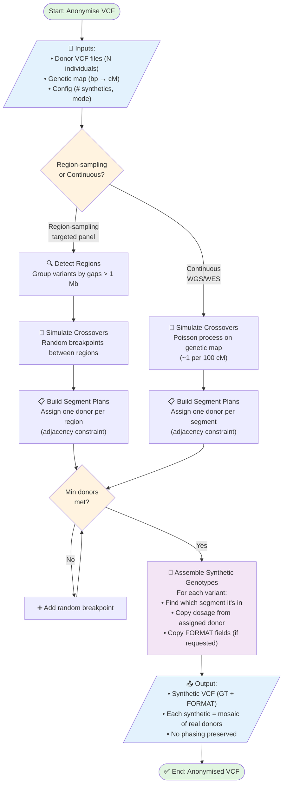

# Shuffle Algorithm Flowchart

## High-Level Overview



## Key Concepts

### 1. **Two Modes**
- **Region-sampling**: For targeted panels with gaps between capture regions (e.g., exome, gene panels)
  - Treats each region as atomic unit
  - Reduces re-identification risk (P2 attack: ~100% → ~5%)

- **Continuous**: For whole-genome or dense coverage
  - Traditional crossover simulation across entire chromosome
  - Higher donor diversity per synthetic

### 2. **Crossover Simulation**
- Mimics meiotic recombination using a genetic map
- Poisson process: ~1 crossover per 100 cM (continuous mode)
- Random breakpoints between regions (region-sampling mode)

### 3. **Adjacency Constraint**
- Consecutive segments never share the same donor
- Prevents trivial re-identification

### 4. **Min Donors Guarantee**
- Ensures each synthetic uses at least N distinct donors
- Adds breakpoints if needed (while loop)

### 5. **Mosaic Assembly**
- Each synthetic individual = patchwork of real donor genotypes
- Unit of swapping: full diploid genotype (dosage 0/1/2)
- No phasing assumed or preserved

---

## Example: Region-Sampling Mode

```
Chromosome 1 (targeted panel with 3 capture regions):

Donors:     [D1] [D2] [D3] [D4] [D5] ... [D138]
             ↓    ↓    ↓    ↓    ↓
Regions:    [===Region1===]  gap  [==Region2==]  gap  [===Region3===]

Synthetic #1 segment plan:
  Region1: D23 ──┐
  Region2: D91 ──┼── Min 3 donors ✓
  Region3: D7  ──┘

Assembly:
  Variant at 10Mb (Region1) → copy D23's genotype
  Variant at 25Mb (Region2) → copy D91's genotype
  Variant at 40Mb (Region3) → copy D7's genotype
```

---

## Why This Works for Anonymisation

1. **No linkage preserved**: Each synthetic's genotype at position X could come from any of N donors
2. **High donor diversity**: Each synthetic uses multiple donors (typically 3-10)
3. **Realistic biology**: Crossover process mimics natural recombination
4. **No inversion**: Can't reverse-engineer which donor contributed which segment without access to original donor VCFs
